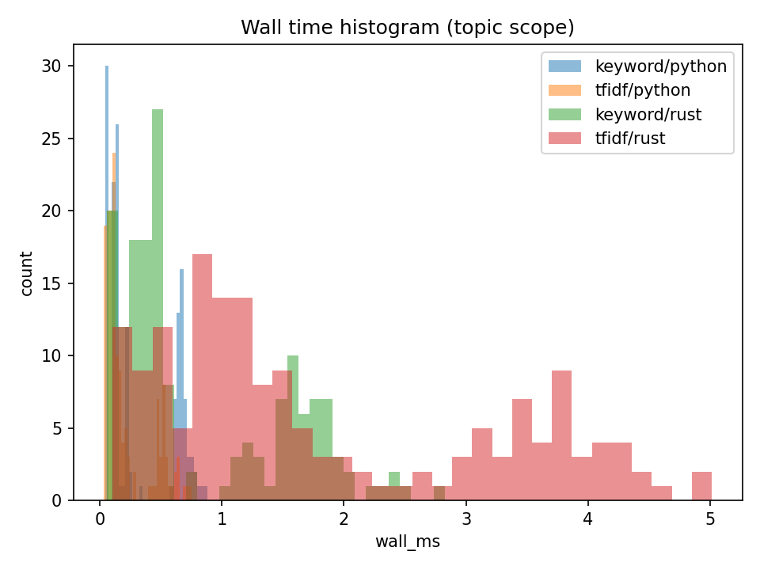

# Rule-Based Chatbot Comparison

*A reproducible benchmark comparing two identical rule-based retrieval chatbots implemented in different programming languages.*

<p align="center">
  <a href="https://github.com/John-JonSteyn/RuleBasedChatbotComparison/stargazers" target="_blank" rel="noopener noreferrer">
    
  </a>
  <a href="https://github.com/John-JonSteyn/RuleBasedChatbotComparison" target="_blank" rel="noopener noreferrer">
    
  </a>
  <a href="https://github.com/John-JonSteyn/RuleBasedChatbotComparison/commits/main" target="_blank" rel="noopener noreferrer">
    
  </a>
  <a href="https://github.com/John-JonSteyn/RuleBasedChatbotComparison/blob/main/LICENSE" target="_blank" rel="noopener noreferrer">
    
  </a>
</p>  

---

## Overview

This repository explores **language parity and performance trade-offs** between two identical retrieval-based chatbots built with the same logic, structure, and dataset.
Both implementations follow an identical **data contract**, enabling fair, evidence-driven benchmarking focused purely on **execution performance** rather than algorithmic differences.

Each chatbot performs deterministic retrieval from deck-based question-answer datasets using:

* **Keyword search** (token overlap)
* **TF-IDF cosine similarity**

The project measures accuracy, latency, and scalability across identical conditions.

---

## Objectives

* Ensure **functional equivalence** between implementations by enforcing a shared parsing, tokenization, and scoring pipeline.
* Quantify **performance differences** between languages without confounding variables.
* Establish a **reproducible benchmark harness** for future experiments in IR (Information Retrieval) efficiency and correctness.

---

## Repository Structure

```
Chatbots/
├─ Python/Source/       # Python CLI implementation
└─ Rust/Source/         # Equivalent Rust CLI implementation
Data/
├─ Decks/               # Text-based Anki exports
└─ Configs/
   ├─ Parser.json
   └─ Stopwords.txt
Tools/
├─ benchmark.py         # Runs benchmarks and writes CSVs/JSONL logs
├─ analyse.py           # Aggregates results, generates plots and reports
└─ README.md
Results/
└─ Bench/
   ├─ results_seed_<N>.csv
   ├─ summary_seed_<N>.csv
   ├─ Plots/
   └─ report_all_seeds.md
```

---

## Benchmark Summary

Benchmarks are deterministic per seed.
Each run samples fixed questions from each deck and measures **accuracy@1**, **median wall-time**, and **stage breakdowns**.

### Accuracy by Algorithm (Topic Scope)

<p align="center">
  
</p>

### Wall-Time Distribution

<p align="center">
  
</p>

### Stage Timing Breakdown

<p align="center">
  
</p>

### Scalability — Median Wall Time vs Deck Size

<p align="center">
  
</p>

### Wall-Time Histogram

<p align="center">
  
</p>

---

## Analysis Workflow

All results can be reproduced and visualised using the built-in analysis tool:

```bash
python Tools/analyse.py
```

This will:

* Aggregate all `results_seed_*.csv` files
* Compute per-implementation and per-algorithm summaries
* Generate `summary_all_seeds.csv` and `speedup_wall_ms.csv`
* Create plots under `Results/Bench/Plots/`
* Build a complete Markdown report (`report_all_seeds.md`) with embedded tables and images

---

## Reproducibility Notes

* Deck sampling and query order are fully deterministic per `--seed`
* Both implementations rely on the same parsing and tokenization rules (`Parser.json`, `Stopwords.txt`)
* Every benchmark logs per-query data to `Results/Bench/seed_<N>_<implementation>.jsonl`
* Analyses and plots are reproducible from CSVs alone (no re-runs needed)

---


## Purpose

This project is a **controlled comparison** of rule-based retrieval systems implemented in two different languages.
It aims to quantify how efficiently each language executes identical logic under matched constraints, offering insights into **practical runtime trade-offs** for future AI and educational applications.
